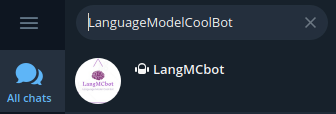
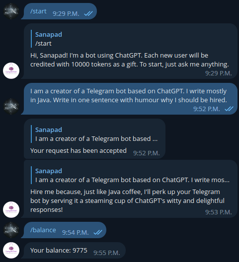
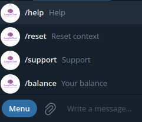
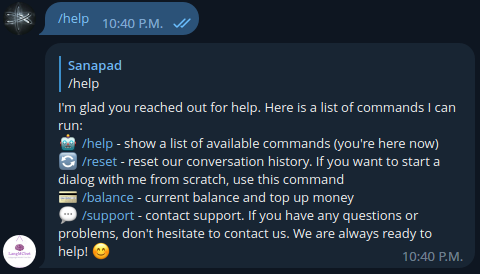

## Description
The `language-telegram-bot` was created purely as a proof-of-concept, for interest and private usage. You can use your own list of OpenAI keys to make it works. You also should have your own telegram bot token.

Features:
- sqlite database:
	- users
	- their conversation context
	- token balance
	- tokens usage
	- table payments (designed but not in use)
- aiogram library
- openai API
- detail logging
- key OpenAI list usage
- in the final release following features were cut:
	- payment support
	- censorship and report to the moderator
	- webhooks
- handling too often user requests to OpenAI

## Using








## Deploy (for Linux)
1. download the project
```bash
git clone https://github.com/sanapad/language-telegram-bot.git
```
3. create a telegram bot: https://t.me/BotFather
4. create OpenAI keys: https://platform.openai.com/account/api-keys
5. set up the `config.py` file (in the root project directory): variables `TOKEN, OPENAI_KEYS, ADMIN_ID` are required
6. create the virtual environment:
```python
python -m venv /path/to/new/virtual/environment
```
to activate the virtual environment (if it already exists):
```python
source venv/bin/activate
```
6. install the requirements:
```python
pip install -r requirements.txt
```
7. give the right to execute (if it hasn't) and run:
```python
chmod +x bot_telegram.py
./bot_telegram.py
```
8. the database and the logs will be created automatically: `database/sqlite_db.py` and `logs.log`
P.S.: these steps are enough for private usage. If you want to use it on the server and decrease the load on your machine then you should change the code in `bot_telegram_file.py` with using webhooks (Telegram API).